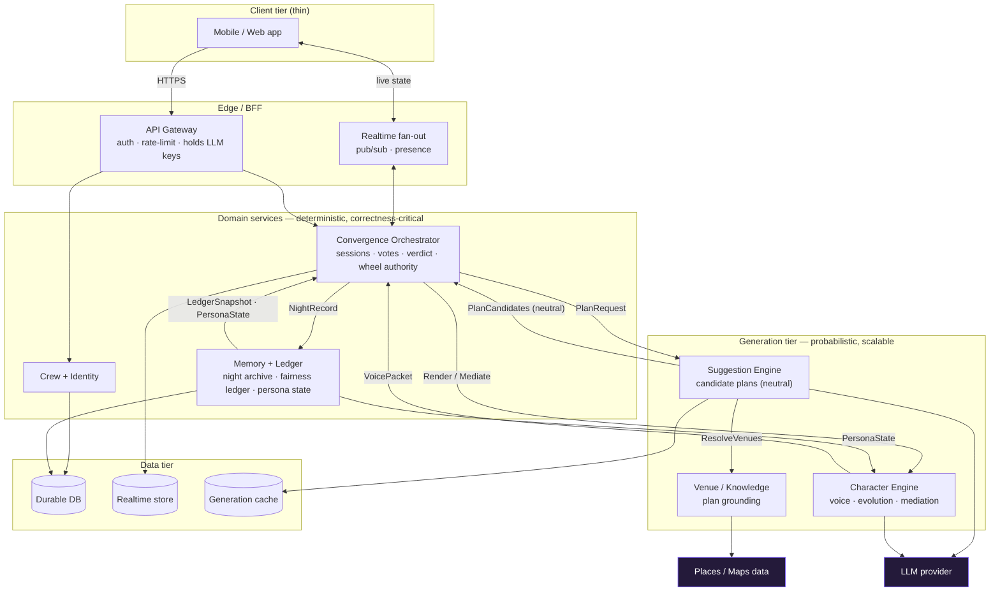
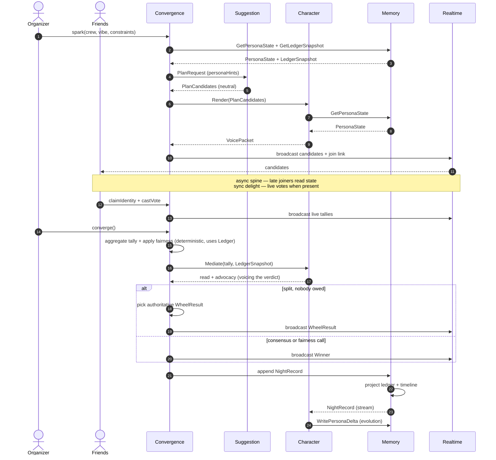

# FunTog — Architecture Reference

A character-driven group event planner. This document captures the high-level subsystem
decomposition, the runtime contracts between subsystems, the principles that let separate
teams evolve and scale each subsystem independently, and a cross-subsystem consistency audit.

Deep-dives for the four core subsystems live in their own documents (see §6).

---

## 1. High-level subsystem architecture

> Note: Suggestion and Character never call each other. The **Orchestrator mediates** — it
> receives the neutral `PlanCandidate` from Suggestion, then asks Character to voice it. This is
> what makes graceful degradation possible (the Orchestrator can broadcast neutral candidates with
> a templated voice if Character is down).

### The two load-bearing seams

**Deterministic core vs. probabilistic generation.** The CORE tier (votes, verdict, wheel) must be
instant, cheap, and always correct. The GEN tier (plan generation, character voice) is slow, costly,
and cacheable. They have opposite scaling profiles and failure modes. Rule: the Orchestrator
**degrades gracefully** — if the entire GEN tier is down, the app can still cast votes, compute a
verdict, and spin an honest wheel (falling back to template plans and templated voice).

**Suggestion (what) vs. Character (how).** Suggestion answers "what could we do" — neutral,
structured plans. Character answers "how does FunTog say it and decide" — voice, evolution,
mediation. They meet at the neutral **PlanCandidate**, and the Orchestrator carries it between them.

---

## 2. Anatomy of a night (contracts in motion)

---

## 3. Subsystem contracts and ownership

| Subsystem | Owns (durable) | Inbound contract | Outbound contract | Scaling profile |
|---|---|---|---|---|
| Crew + Identity | Crews, members, join tokens | `CreateCrew`, `JoinByLink` | `CrewProfile`, `MemberRef` | Low, steady |
| Convergence Orchestrator | Live session (ephemeral) | `OpenSession`, `CastVote`, `Converge` | `SessionState`, `WheelResult`, `NightRecord` | Spiky, per-session, realtime |
| Suggestion Engine | — (stateless + cache) | `PlanRequest` | `PlanCandidate[]` | Bursty, LLM-bound, cache-heavy |
| Character Engine | Persona registry | `Render`, `Mediate`, `SetPersona/Overrides` | `VoicePacket`, `PersonaDelta` | Bursty, LLM-bound |
| Memory + Ledger | Nights, ledgers, persona state | `NightRecord`, `PersonaDelta`, queries | `PersonaState`, `LedgerSnapshot` | Append-only, read-scaled |
| Venue / Knowledge | Venue cache | `ResolveVenues` | `VenueRef[]` | Read-heavy, external-rate-limited |

---

## 4. Governing principles

**Schema-first, versioned contracts.** Every contract noun is an explicit, backward-compatible
schema. That schema *is* the integration surface; teams ship against the contract, not internals.

**Three interaction styles:** synchronous RPC for generation (`PlanRequest → PlanCandidate[]`),
pub/sub for live session events (votes, tallies, wheel), and an append-only event stream for Memory
(`NightRecord` consumed asynchronously). The event stream keeps "getting smarter" off the hot path.

**Wheel authority is server-side and verifiable.** Chosen once, equal slices, seed stored in the
NightRecord; clients animate toward a predetermined slice. Impossible to rig or re-roll.

**Individual personalization lives upstream of the wheel, never inside it.** Per-person history trains
suggestions and powers transparent advocacy; the wheel's slices stay equal. Train the brain, not the dice.

**Define seams now; distribute later.** Start as a modular monolith with these as hard module
boundaries. Split a module into a service when its scaling profile or team velocity demands it — the
contract already exists, so the split is a deployment change, not a rewrite.

---

## 5. What persists vs. what is ephemeral

- **Durable:** Crew, members, fairness ledger, PersonaState, and the append-only Night archive.
- **Ephemeral:** live votes-in-progress and presence.

---

## 6. Subsystem deep-dives

| Subsystem | Defining decision | Document |
|---|---|---|
| Convergence Orchestrator | Session state machine + deterministic core isolated from generation | `funtog-orchestrator.md` |
| Character Engine | PersonaState precedence: override > learned > base; hot render vs cold evolution | `funtog-character-engine.md` |
| Memory + Ledger | Event store with rebuildable projections (CQRS) | `funtog-memory-ledger.md` |
| Suggestion Engine | Two-phase generation: creative structure (LLM) → factual grounding (data) | `funtog-suggestion-engine.md` |

Each has standalone `.mermaid` files for its diagrams. Crew + Identity and Venue / Knowledge are
intentionally not deep-dived yet — both are well-trodden patterns (link-join + lightweight identity;
an external-data integration wrapper with caching) with no hard architectural decision to make until
they are built.

---

## 7. Cross-subsystem contract matrix (consistency proof)

Every contract has exactly one producer and at least one named consumer. Every consumer input traces
to a producer.

| Contract noun | Produced by | Consumed by | Shape |
|---|---|---|---|
| `PlanRequest` | Orchestrator | Suggestion | constraints, area, vibe, personaHints, groundingMode |
| `PlanCandidate[]` (neutral) | Suggestion | Orchestrator → Character | arc, stops (slot or venueRef), satisfiedConstraints |
| `VoicePacket` | Character | Orchestrator → clients | name, tagline, notes, pitch / read / advocacy |
| `SlotSpec` / `VenueRef[]` | Suggestion ↔ Venue | (internal to grounding) | typed venue constraint / bound venue |
| `tally` | Orchestrator (Tally Projector) | Character (Mediate input) | per-plan counts |
| `LedgerSnapshot` | Memory (ledger projection) | Orchestrator (verdict); passed to Character (Mediate) | got / overruled / streak |
| `PersonaState` | Memory (projection) | Orchestrator (derive hints); Character (voice resolution) | base + learned + overrides |
| `PersonaDelta` | Character (evolution) | Memory (append) | bounded learned adjustment |
| `Overrides` / `SetPersona` | Character customization API | Memory (append) | declared intent (highest precedence) |
| `NightRecord` | Orchestrator (Persistence Writer) | Memory (append) + Character evolution (stream) | the immutable fact of a night |
| `WheelResult` | Orchestrator (Wheel Authority) | clients (via Realtime); stored in NightRecord | planId + seed |
| `SessionState` / `TallyUpdated` / `VerdictReached` | Orchestrator | clients (via Realtime) | broadcast session state |

---

## 8. Consistency audit notes

**One genuine contradiction found and fixed.** Earlier drafts of the top-level diagram and the night
sequence showed Suggestion calling Character directly (`Suggestion → Character`). The subsystem
deep-dives and the degradation matrices assume the **Orchestrator mediates** — it holds the neutral
`PlanCandidate` between the two calls so it can broadcast with a templated voice if Character is
unavailable. Direct coupling would have broken that fallback and coupled two independently-owned GEN
subsystems. Resolved: Suggestion returns `PlanCandidate[]` to the Orchestrator; the Orchestrator calls
Character to render. All diagrams now reflect this.

**Deliberate refinements from prototype to architecture (not inconsistencies).**
- The fairness *decision* (winner vs. wheel, which plan) moved out of the LLM into the Orchestrator's
  deterministic Verdict Engine. The LLM (Character) now only *voices* that decision. In the prototype
  a single LLM call did both.
- Plan *structure* and *voice* were merged in the prototype (the model wrote cheeky names inline).
  The architecture splits them at the neutral `PlanCandidate`.
- Cross-night memory was React session state in the prototype; the architecture event-sources it in
  Memory so it survives and is rebuildable.

**Read paths elided from the top-level diagram for clarity (not contradictions).**
- Customization endpoints (`SetPersona` / `SetOverrides`) are part of the Character Engine's API
  surface; their writes persist to Memory as override events.
- Nostalgia reads (apps fetching `GetCrewTimeline` from Memory) and persona reads by both Orchestrator
  and Character are real but omitted from the top-level view to keep it legible. They appear in the
  subsystem diagrams.

**Naming is normalized across all documents:** `PlanRequest`, `PlanCandidate`, `VoicePacket`,
`LedgerSnapshot`, `PersonaState`, `PersonaDelta`, `NightRecord`, `WheelResult`, `SlotSpec`, `VenueRef`.

**Degradation matrices are mutually consistent.** Each subsystem's "if X is down" row matches the
mirror row in the subsystem it depends on (e.g. Memory "query down → Orchestrator decides on votes
only" matches Orchestrator "ledger read down → decide on votes only").
