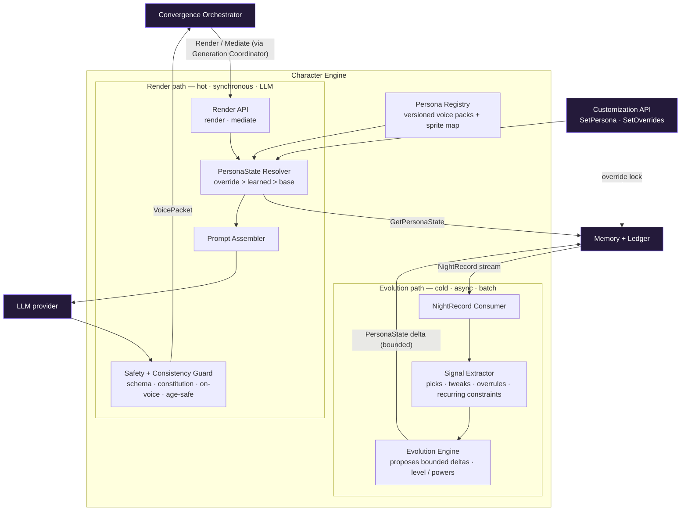
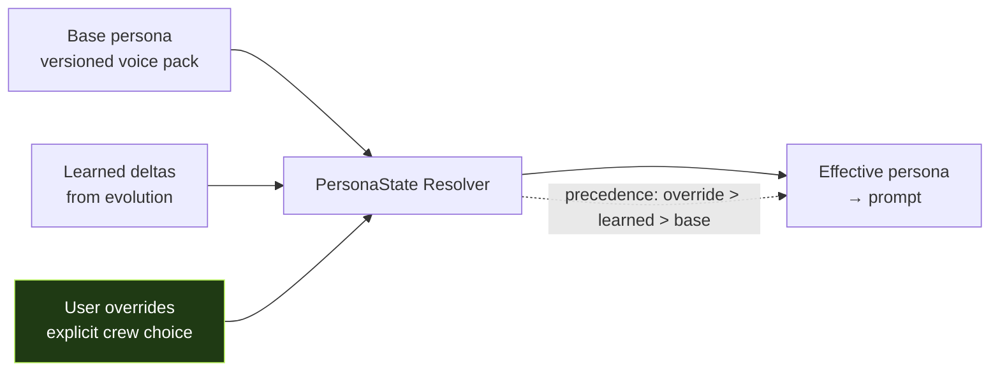

# FunTog — Character Engine (subsystem deep-dive)

The moat. Owns FunTog's persona, voice, evolution, and mediation/advocacy. Where the
Orchestrator protects *correctness*, the Character Engine protects *character integrity* —
the thing that makes FunTog feel like a friend and not a chatbot in a costume.

---

## Internal component architecture



### The two paths (the headline separation)

The Character Engine has two workloads with opposite shapes, and they are kept decoupled —
they share only the PersonaState store, never runtime.

- **Render path — hot, synchronous, LLM-bound, latency-sensitive.** During a live session it
  turns neutral `PlanCandidate[]` into an in-character `VoicePacket`, and turns `tally +
  LedgerSnapshot` into the read and the fairness advocacy. Runs behind the Orchestrator's
  Generation Coordinator (breaker + timeout + fallback).
- **Evolution path — cold, asynchronous, batch.** It consumes the append-only `NightRecord`
  stream, extracts learning signals, and proposes bounded deltas to PersonaState. No user-facing
  latency, scales on its own cadence, never on the hot path.

### The components

- **Persona Registry** — versioned voice packs. Each pack is the persona definition (the
  prompt-level voice) plus its sprite/mood mapping (the face). This is where "different character
  per group" lives, and where persona improvements ship as data, not code.
- **PersonaState Resolver** — composes the *effective* persona for a crew with strict precedence
  (see below). The defining component of the subsystem.
- **Prompt Assembler** — builds the model prompt from the resolved persona + the request
  (candidates to voice, or tally+ledger to mediate).
- **Safety + Consistency Guard** — validates every output: schema, the character constitution,
  on-voice consistency (anti-drift), and age-appropriate / brand-safe content. Non-negotiable,
  on every render.
- **NightRecord Consumer / Signal Extractor / Evolution Engine** — the learning loop. Extracts
  what the crew picked, tweaked, and who got overruled, and proposes bounded PersonaState deltas
  (including level / unlocked "powers").

---

## The defining decision: PersonaState resolution



`PersonaState` is composed, not stored flat:

```
PersonaState {
  crewId
  basePersonaId + version      // which voice pack
  learnedDeltas { dials, preferences, unlockedPowers, level }   // from evolution
  overrides { ...explicit locks the crew set... }               // customization
}
effectivePersona = merge(base, learnedDeltas, overrides)         // overrides win
```

**Customization is the steering wheel; evolution is cruise control; the wheel always wins.**
If the crew set FunTog to "chill" but the evolution path is drifting it toward "chaotic,"
the override wins — every time. Evolution *proposes*; the crew *disposes*. This is enforced in
the Resolver, not left to convention, because the moment FunTog feels like it has its own agenda
that overrides what the crew asked for, it stops feeling like *theirs* — and that is a
trust-killer.

---

## Core design positions

**1. Persona is data, not code.** Voice packs are versioned assets (prompt-level voice + sprite
mapping). "Different character per group" is configuration; persona improvements ship without a
deploy. This is the prototype's isolated `PERSONAS` object taken to its conclusion.

**2. The two paths never couple at runtime.** Hot render and cold evolution share only the
PersonaState store. They scale, fail, and deploy independently.

**3. The Safety + Consistency Guard sits on every output and is never bypassed.** It enforces
the character constitution (no drift / degradation over long histories), schema validity,
on-voice consistency, and age-appropriate, brand-safe content. If a check fails, the engine
drops to a safe on-brand template — it never emits unvalidated output.

**4. Evolution is bounded and reversible.** Learned deltas adjust *within* a persona's range —
they can never change identity. Deltas are written to Memory as an event-sourced history (not
destructive overwrites), so a crew's FunTog growth is auditable and roll-back-able. And because
overrides win, the crew can always snap it back.

**5. Fairness advocacy is a render mode, not a separate brain.** The `mediate` call consumes the
deterministic `tally + LedgerSnapshot` (computed by the Orchestrator) and only *voices* the
fairness call FunTog is making. The decision stays deterministic upstream; the Character Engine
gives it a voice. This is exactly the fairness-keeper from the prototype.

---

## Graceful-degradation matrix

| If this is down | Behaviour | Character impact |
|---|---|---|
| LLM (render) | Serve on-brand templated voice lines from the voice pack | Less spark, still in-character |
| PersonaState read | Fall back to base persona | In-character but un-evolved this night |
| Evolution path | Backlog NightRecords, process later | None live (async); learning just delayed |
| Safety Guard fails a check | Drop to safe template, never emit | Output always safe + on-voice |

---

## Contract surface (the Character Engine's API)

**Render path (from Orchestrator, breaker-wrapped)**
- `Render(crewId, PlanCandidate[]) → VoicePacket` (intro + per-plan pitch)
- `Mediate(crewId, tally, LedgerSnapshot) → VoicePacket` (read + advocacy line that voices the Orchestrator's deterministic verdict)

**Customization**
- `SetPersona(crewId, personaId)`
- `SetOverrides(crewId, overrides)` (explicit locks — highest precedence)

**Evolution path (async)**
- consumes `NightRecord` events from Memory
- emits `PersonaState delta` to Memory

**Dependencies**
- Memory: `GetPersonaState` (read), `WritePersonaDelta` (write), `NightRecord` stream (consume)
- LLM provider (render only)
- Persona Registry (internal, versioned)

---

## Scaling profile

- **Render path:** bursty, LLM-bound, stateless per request (state comes from the PersonaState
  read). Scale horizontally behind a queue; semantic-cache common renders keyed on
  (effective persona + plan shape). Latency-sensitive.
- **Evolution path:** async batch consumer, partitioned by crew, run on its own cadence
  (per-night or nightly). Cheap, independently scalable, off the hot path.

The two paths being independently scalable is the point — live voice never waits on learning,
and learning never competes with live voice.
