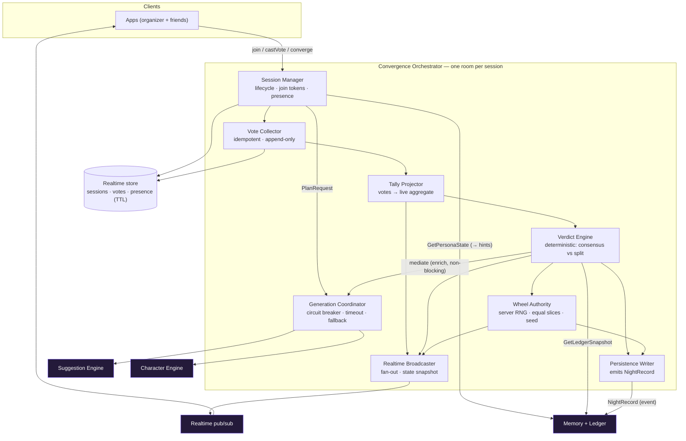
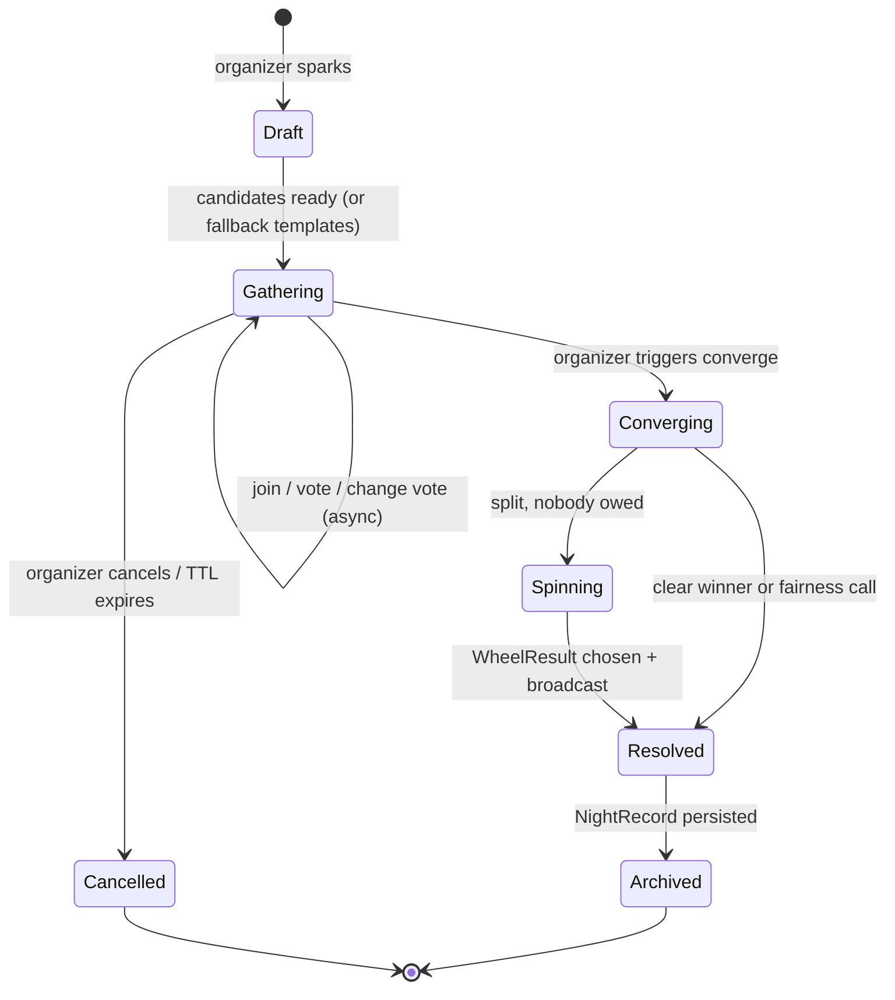

# FunTog — Convergence Orchestrator (subsystem deep-dive)

The realtime heart of FunTog. Owns the live session, vote collection, the deterministic
verdict, wheel authority, and the graceful-degradation boundary to the generation tier.
It is the one subsystem where correctness, realtime, and trust all meet.

---

## Internal component architecture

### The components

- **Session Manager** — owns the lifecycle state machine, join tokens, lightweight identity claim, and (soft) presence.
- **Vote Collector** — ingests votes as an append-only, idempotent event log. One effective vote per member, changeable until lock.
- **Tally Projector** — a pure reducer that derives the live aggregate from the vote log. The tally is a projection, never mutable counters.
- **Verdict Engine** — the deterministic brain: detects consensus vs. split, applies the fairness rule using the ledger, and decides winner vs. spin. Pure given (votes + ledger).
- **Wheel Authority** — server-side RNG. Picks one authoritative result among finalists with equal slices, stores the seed for auditability.
- **Generation Coordinator** — the only path to the GEN tier (Suggestion, Character). Wraps every call in a circuit breaker with a hard timeout and a fallback. This is the degradation boundary.
- **Realtime Broadcaster** — fan-out of state changes plus a full-state snapshot for late joiners (the async spine).
- **Persistence Writer** — at resolution, emits the append-only NightRecord to Memory.

---

## Session lifecycle (the most important contract)

The session state machine is the contract every client and team codes against. It makes
"what can happen when" unambiguous.

Key rules baked into the machine:
- **Presence never gates a transition.** Async spine: you can move forward whether or not everyone is "in the room." Presence only drives the live-animation delight layer.
- **Converge is organizer-authorized; the verdict is system-owned.** A human picks the moment; no human picks the winner.
- **Spinning is reached only on a genuine split with nobody owed.** Consensus or a fairness call resolves directly to a winner.

---

## Core design positions

**1. Event-sourced votes, projected tally.** Votes are an append-only log; the tally is a
reducer over that log. This gives idempotency, auditability, replay for late joiners, and
clean last-write-wins on vote changes — and it naturally models people drifting in over time.

**2. The deterministic core is isolated from the probabilistic tier via the Generation
Coordinator.** The Verdict Engine's decision (winner vs. spin) is pure given votes + ledger.
Plan generation and character voice are *enrichment*: routed through a circuit breaker with a
hard timeout and a fallback. Principle: the GEN tier enriches, it never blocks. Votes, verdict,
and wheel always work.

**3. Wheel authority is server-side and verifiable.** The result is chosen once, with equal
slices among finalists, and the RNG seed is stored in the NightRecord. Clients animate toward a
predetermined slice. The drama is local; the truth is server-side; nobody can rig or re-roll.

**4. Fairness lives in the Verdict Engine via the ledger, not in the wheel.** Per-person history
(LedgerSnapshot) can tip a *close* verdict toward someone who is owed — transparently, named out
loud by the Character Engine. The wheel's slices stay equal. Train the brain, not the dice.

**5. A session is an isolated actor / room.** State is sharded by sessionId; hot state lives in
the realtime store with a TTL and is flushed to durable storage only at resolution. One session's
load never touches another, and a crashed session can't take others down. Horizontal scale = more
rooms.

---

## Graceful-degradation matrix

| If this is down | Behaviour | Correctness impact |
|---|---|---|
| Suggestion Engine | Fall back to template plan shapes | None — gather + vote proceed |
| Character Engine | Deterministic verdict + templated voice line | None — fairness math still applied, just less flavour |
| Memory (ledger read) | Decide on votes only this night; reconcile later | Fairness skipped for one night |
| Memory (write) | Buffer NightRecord, retry async | None to the live UX |
| Realtime pub/sub | Clients fall back to snapshot polling | None — state is authoritative in the store |

---

## Contract surface (the Orchestrator's API)

**Inbound commands**
- `OpenSession(crewId, sparkInput) → sessionId, joinToken`
- `JoinByLink(joinToken) → SessionState` and `ClaimIdentity(sessionId, memberRef)`
- `CastVote(sessionId, memberId, planId, clientSeq)` (idempotent)
- `ChangeVote(...)` (until lock)
- `Converge(sessionId)` (organizer only)

**Outbound events (via Realtime)**
- `SessionState` (full snapshot, for late joiners)
- `TallyUpdated`
- `VerdictReached(winner | spinning)`
- `WheelResult(planId, seed)`

**Internal dependencies**
- `→ Suggestion: PlanRequest` (via Generation Coordinator, breaker-wrapped)
- `→ Character: Render / Mediate` (via Generation Coordinator, breaker-wrapped)
- `→ Memory: GetLedger / GetPersonaState` (direct read), `NightRecord` (append-only write)

---

## Why these boundaries hold up

The split between **deterministic orchestration** (votes, tally, verdict, wheel) and
**probabilistic enrichment** (plans, voice) means the team owning correctness and the team
owning the GEN tier rarely touch the same code. The state machine is the shared truth. The
Generation Coordinator is the single, testable seam where flakiness is contained. And because a
session is an isolated room, the subsystem scales by partitioning, not by coordination.
