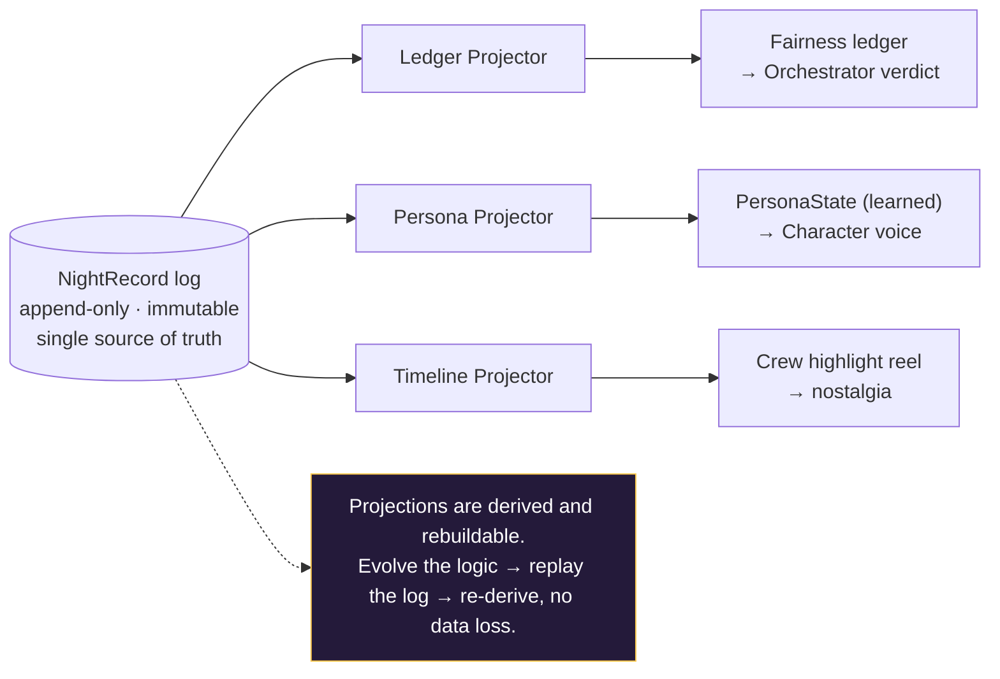
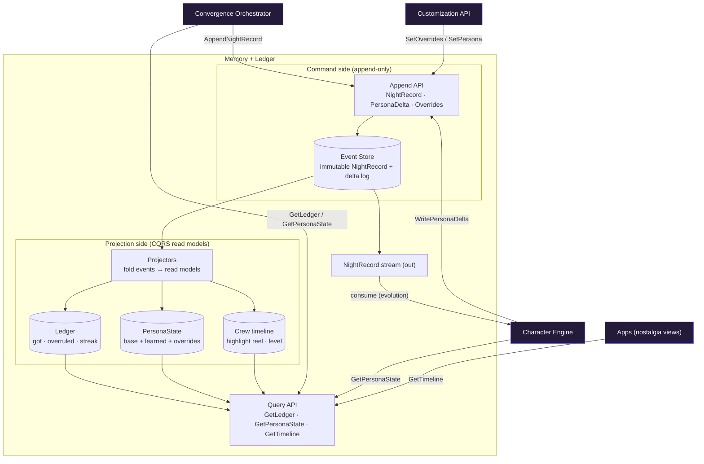

# FunTog — Memory + Ledger (subsystem deep-dive)

The system of record. Owns the durable night archive, the fairness ledger, the evolving
persona state, and the crew's accumulating story. Both the Orchestrator and the Character
Engine depend on its contracts. It records facts and serves projections — it never decides.

---

## The defining decision: event store with projections (CQRS)

Memory is not a CRUD database. It is an append-only log of immutable facts (`NightRecord`),
plus a set of read-optimized projections derived from that log. Everything queryable — the
fairness ledger, persona state, the crew timeline — is a *projection*, rebuildable from the log.



Why this is the right backbone:

- **One immutable log, two payoffs.** The same `NightRecord` archive powers the crew's story
  (the nostalgia / retention loop) *and* the evolution learning signal (the moat). The thing
  that drives retention and the thing that makes FunTog smart are literally the same data, read
  two ways. Product and architecture aligned.
- **Replayability is the reason to event-source.** The "how FunTog learns" and "how fairness is
  computed" logic *will* change repeatedly. With an event log you re-derive projections by
  replaying — you evolve the algorithms without migrations or data loss. For a product whose
  intelligence iterates, this is decisive.
- **Facts are authoritative; projections are disposable.** You can drop and rebuild the ledger or
  the timeline at any time. The only thing you must never lose is the append-only log.

---

## Internal component architecture



### The components

- **Append API + Event Store** — the single write path. Accepts immutable `NightRecord`s (from the
  Orchestrator), `PersonaDelta`s (from Character evolution), and `Overrides`/`SetPersona` (from
  Customization). Append-only; writes never conflict.
- **Projectors** — async workers that fold the event log into read models. Re-runnable.
- **Read models** — Ledger (the prototype's crewHistory), PersonaState (base + learned + overrides),
  Crew timeline (highlight reel + level). Read-optimized, cached, point-lookup by crewId.
- **Query API** — serves the read models to the hot path (Orchestrator, Character) and to nostalgia
  views (apps).
- **NightRecord stream** — the outbound event feed the Character Engine's evolution path consumes.

---

## Core design positions

**1. Memory records facts and serves projections — it does not decide.** The deterministic verdict
lives in the Orchestrator; the advocacy voice lives in the Character Engine. Memory is the neutral
substrate. This keeps it from drifting into a god-service.

**2. Async projections are invisible because of the product's rhythm.** Hot-path reads
(LedgerSnapshot, PersonaState) can be eventually consistent. The ledger updates *between* nights,
and fairness applies to the *next* night, not the one in progress — so a few seconds of projection
lag after a night resolves is unobservable. Don't pay for strong consistency you don't need.

**3. Overrides are declared intent, not derived.** User customization (the highest-precedence layer
of PersonaState) is stored as direct command facts (latest wins), never inferred. Memory keeps the
boundary clean: learned signal vs. declared intent.

**4. Privacy by crew isolation + delete-by-replay.** Social-dynamics data is sensitive. Partition by
crewId; right-to-delete means purge the crew's event log and let projections rebuild empty. Event
sourcing makes deletion cleaner, not harder.

---

## The central fact: NightRecord

```
NightRecord {
  nightId, crewId, timestamp
  sparkInput      { vibe, budget, area, constraints }
  candidatePlans  [ PlanCandidate... ]
  votes           [ { memberId, planId } ]
  verdict         { type: winner|wheel, planId, wheelSeed? }
  fairnessCall    { for?: memberId, applied: bool }
  tweaks          [ ... ]
}
```

Immutable. Every projection (ledger, persona learning, timeline) is a fold over a stream of these.

---

## Graceful-degradation matrix

| If this is down | Behaviour | Impact |
|---|---|---|
| Append (event store write) | Orchestrator buffers NightRecord in a durable queue, retries | None to live UX; facts must never be lost |
| Projection lag / stale read model | Serve last-known projection | None — the product rhythm hides it |
| Query (read model) | Orchestrator decides on votes only; Character falls back to base persona | Fairness + personalization skipped one night |
| Stream consumer (evolution) | Backlog events, replay later | None live; learning delayed |

These rows are the mirror image of the degradation rows in the Orchestrator and Character
matrices — Memory degrades gracefully precisely because its consumers were designed to tolerate it.

---

## Contract surface (Memory's API)

**Commands (append-only)**
- `AppendNightRecord(NightRecord)` — from Orchestrator at resolution
- `WritePersonaDelta(crewId, delta)` — from Character evolution
- `SetOverrides(crewId, overrides)` / `SetPersona(crewId, personaId)` — from Customization

**Queries**
- `GetLedgerSnapshot(crewId) → LedgerSnapshot`
- `GetPersonaState(crewId) → PersonaState` (base + learned + overrides, resolve-ready)
- `GetCrewTimeline(crewId) → highlight reel + level`

**Streams**
- `NightRecord` stream (consumed by Character evolution; future: analytics)

---

## Scaling profile

- **Append path:** cheap, high-throughput, immutable, partitioned by crewId. Appends never conflict.
- **Read models:** read-optimized and cached; point lookups by crewId. Scale reads independently of writes.
- **Projectors:** async workers, scalable per projection, re-runnable for replay.

This is the "append-only, read-scaled" profile from the high-level table — and the replay capability
is what lets the learning and fairness logic keep evolving without ever touching the source of truth.
