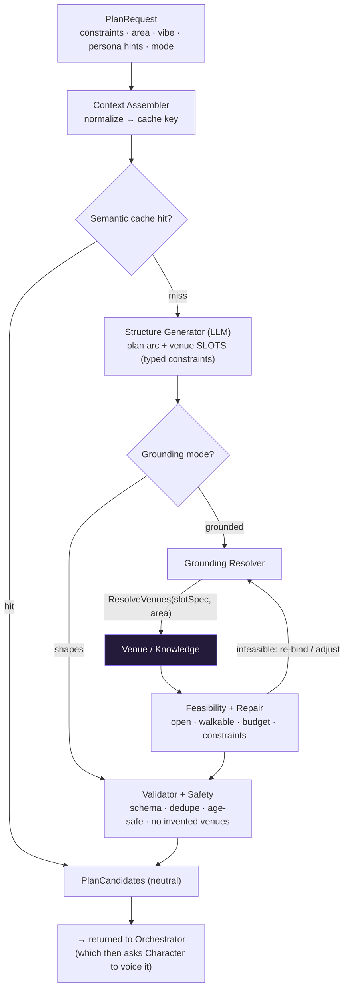
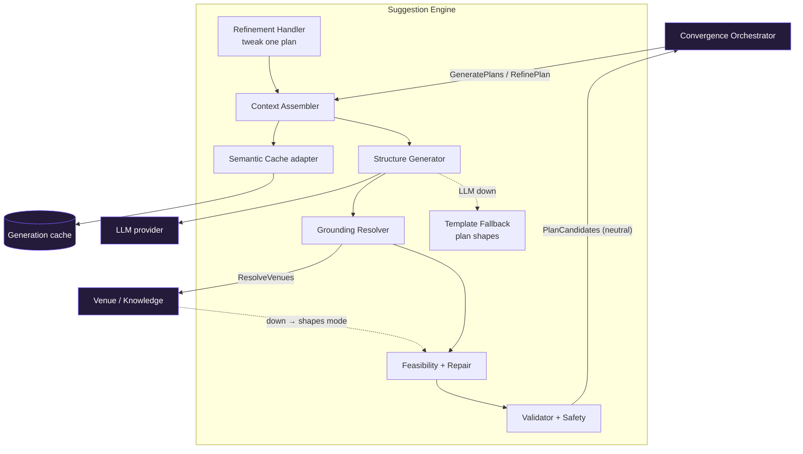

# FunTog — Suggestion Engine (subsystem deep-dive)

Produces the candidate plans. Takes a `PlanRequest` (crew constraints + persona hints +
locale) and returns neutral `PlanCandidate[]` — the structure, the arc, the where/when. The
Character Engine voices them afterward. This is where the venue-grounding problem lives, and
where it is deliberately contained.

---

## The defining decision: two-phase generation (never ask the LLM for facts)

The LLM is excellent at creative *structure and arc* and unreliable at *factual venue data*
(it hallucinates places, hours, prices). So we never ask it for facts. It produces a plan
skeleton with typed venue **slots**; a real data source fills those slots; a feasibility pass
checks the bound plan holds together.



Why this shape:

- **Creative structure, factual grounding, joined by a slot contract.** The LLM emits an abstract
  plan (e.g. small-plates → lively bar → late-night sweet) where each stop is a *slot* — a typed
  constraint ("lively natural-wine bar, walkable, mid-price, has veg"). The Grounding Resolver binds
  each slot to a real venue from the data source. Facts never come from the model.
- **Grounding is a switchable mode, not a rebuild.** "Shapes" mode (vivid venue *types*) ships today
  and skips binding; "grounded" mode turns on real venues later. The structure-generation logic does
  not change — this honours the sequencing of proving plan quality before wading into the venue swamp.
- **The feasibility + repair loop guarantees plans that actually work** — open at the right time,
  walkable in sequence, within budget, constraints satisfied — re-binding alternatives when a bound
  plan fails.

---

## Internal component architecture



### The components

- **Context Assembler** — normalizes the request (constraints, area, vibe, persona hints) into a
  generation context and a cache key.
- **Semantic Cache** — returns prior candidate sets for common normalized requests before any LLM call.
- **Structure Generator (LLM)** — produces plan skeletons: arc + typed venue slots. No real names.
- **Grounding Resolver** — binds each slot to a real venue via the Venue/Knowledge service. Skipped in shapes mode.
- **Feasibility + Repair** — validates bound plans (temporal, spatial, budget, constraint satisfaction); re-binds on failure.
- **Validator + Safety** — schema, dedupe (variety across the 3), age-appropriate / brand-safe, no-invented-venue check.
- **Refinement Handler** — the "tweak this" path: re-generates one PlanCandidate from feedback, re-grounding only affected slots.
- **Template Fallback** — deterministic plan-shape library for when the LLM or Venue service is unavailable.

---

## The structure / voice seam

This subsystem owns *what / where / when*. The Character Engine owns *what it's called and how
it's sold*. The neutral `PlanCandidate` is the seam between them.

| Suggestion owns (structure) | Character owns (voice) |
|---|---|
| plan arc and stop sequence | the plan's name |
| venue slots / bound venue refs | the tagline / through-line phrasing |
| timing, budget, feasibility | the per-stop cheeky note |
| constraint satisfaction | the pitch / sell |

In the prototype these were merged for speed (the LLM wrote cheeky names and notes inline). In the
real architecture they split here: Suggestion emits neutral structure, Character renders the voice.

---

## Contracts

**Inbound (from Orchestrator, breaker-wrapped)**
- `GeneratePlans(PlanRequest) → PlanCandidate[]`
- `RefinePlan(PlanCandidate, feedback) → PlanCandidate`

```
PlanRequest {
  crewConstraints { veg, budget, dislikes, ... }
  area, vibe
  personaHints        // crew tendencies, fetched by Orchestrator from Memory
  groundingMode       // "shapes" | "grounded"
}
PlanCandidate (neutral) {
  id, arc
  stops [ { time, venueType | venueRef, satisfiedConstraints } ]
}
SlotSpec { venueType, priceBand, mustHave[], walkableFromPrev }
```

**Outbound (to Venue / Knowledge)**
- `ResolveVenues(SlotSpec[], area, constraints) → VenueRef[]`

**Dependencies:** LLM (structure only), Venue/Knowledge (grounding), Generation cache.
Note: the Suggestion Engine is **stateless** given the `PlanRequest` — persona hints arrive in the
request (the Orchestrator already fetched PersonaState). This keeps it testable, cacheable, and
horizontally scalable.

---

## Graceful-degradation matrix

| If this is down | Behaviour | Impact |
|---|---|---|
| LLM (structure) | Template plan shapes from the library | Less novelty; gather + vote still proceed |
| Venue / Knowledge | Fall back to shapes mode (descriptive types) | Plans generated but not bookable |
| Semantic cache | Generate directly | Slower / costlier, still works |
| Feasibility unsatisfiable | Relax a constraint with a flagged note, or best-effort + warning | Plan may need manual tweak |

---

## Scaling profile

Bursty and LLM-bound. Scale horizontally behind a queue; lean hard on the semantic cache (common
vibe + area + constraint combinations recur). Grounding caches by area + slot constraints and scales
independently of structure generation. Because the engine is stateless per request, scaling is pure
replication.

---

## Why the boundary holds

The venue-data swamp — rate limits, coverage gaps, freshness, normalization — is isolated entirely
inside the Venue/Knowledge subsystem, behind the `ResolveVenues` contract. The Suggestion Engine
only speaks slot specs and venue refs. So when grounding gets hard (and it will), the difficulty is
contained in one subsystem, and the rest of the pipeline — structure, feasibility, the seam to
Character — is untouched.
